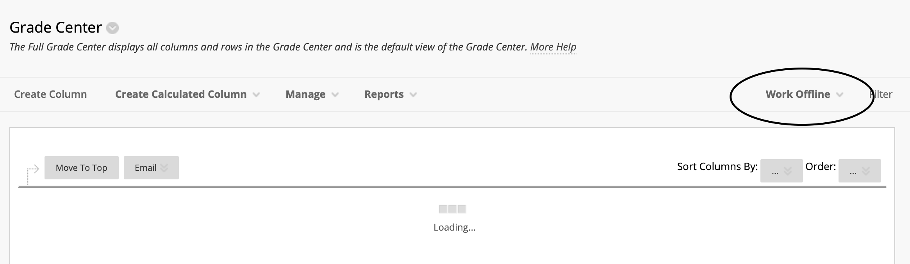
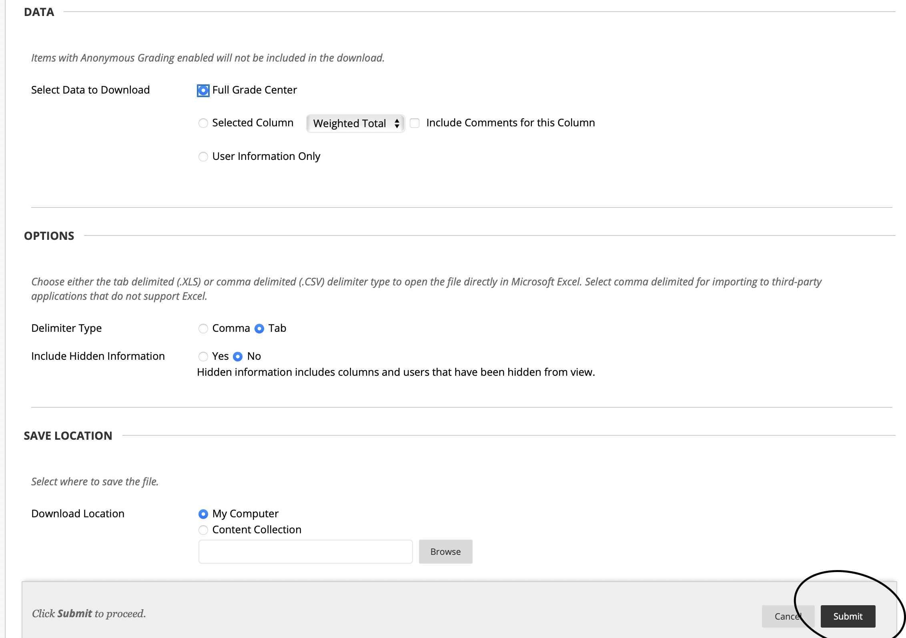

# Grade Format script for GMU-CS310 (current sem: Spring23)

### Dependencies :

> Pandas.

> Numpy

> Python 3.

### Folder structure

GRADE_FORMATTER

    ├── media
    
    ├── blackboard_downloaded
    
    │   ├── somefile.xls [Excel file from Blackboard Grade Center --> Work Offline --> Download] 
    
    ├── manual
    
    │   ├── manual.xls [ YOUR_OWN_MANUAL_GRADE_FILE ]
    
    ├── output
    
    │   ├── upload.xls [ OUTPUT FILE ]
    
    │   ├── feedbackFile.xls [ OUTPUT FILE ]
    
    ├── manual
    
    ├── grade_formatter.py
    
    └── README.md

### Work order

> Download grade file from BB Grade Center



> Make sure the format of the manual file is EXACTLY like this


> Run the formatter AFTER all the above directions are followed

```
python3 grade_formatter.py
```

> Then go to GRADE CENTER --> Work Offline --> Upload, then upload "upload_file.xls" in output folder

> Go back to GRADE CENTER/ ASSIGNMENT, sort students by lastname (From A to Z)

> MANUALLY upload students' project feedback with the feedback from "feedbackFile.xls" in output folder
